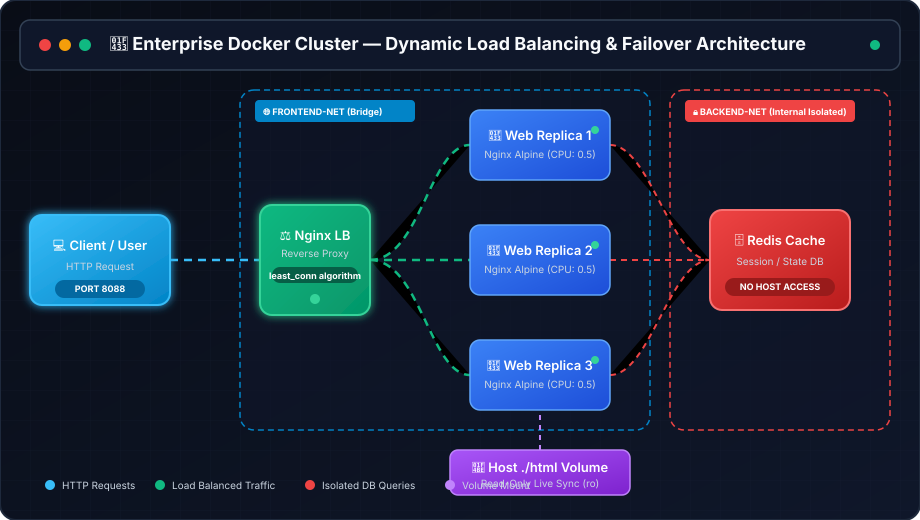
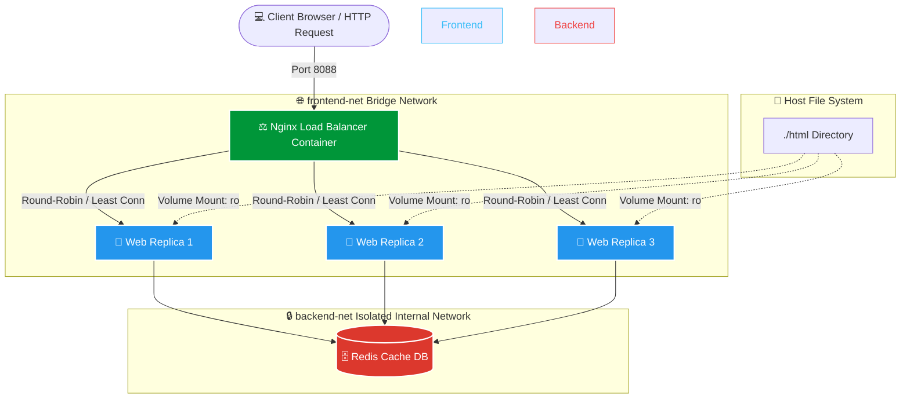

<div align="center">

# 🐳 Enterprise Docker Web Server & Orchestration Stack

<p align="center">
  <b>A Production-Grade, High-Availability Nginx Load-Balanced Web Server Cluster with Auto-Healing &amp; Multi-Tier Network Isolation</b>
</p>

[](https://www.docker.com/)
[](https://nginx.org/)
[](https://redis.io/)
[](https://microsoft.com/)
[](LICENSE)

<br/>

```
  ____             _             __        __ _     ____                          
 |  _ \  ___   ___| | _____ _ __ \ \      / /___| |__ / ___|  ___ _ ____   _____ _ __ 
 | | | |/ _ \ / __| |/ / _ \ '__| \ \ /\ / / _ \ '_ \\___ \ / _ \ '__\ \ / / _ \ '__|
 | |_| | (_) | (__|   <  __/ |     \ V  V /  __/ |_) |___) |  __/ |   \ V /  __/ |   
 |____/ \___/ \___|_|\_\___|_|      \_/\_/ \___|_.__/|____/ \___|_|    \_/ \___|_|   
```

<br/>


<br/><br/>

<p align="center">
  <a href="#-key-features">Key Features</a> •
  <a href="#%EF%B8%8F-animated-system-architecture">Animated Architecture</a> •
  <a href="#-quick-start">Quick Start</a> •
  <a href="#-live-demonstration-suite">Live Demo Suite</a> •
  <a href="#-production-specifications">Specifications</a>
</p>

---

</div>

## 🌟 Key Features

| Feature | Description | Status |
| :--- | :--- | :---: |
| ⚖️ **Nginx Load Balancer** | Enterprise reverse proxy using `least_conn` routing across backend replicas | `ACTIVE` |
| ⚡ **Horizontal Scaling** | Dynamic multi-replica cluster scaling up to 5+ web nodes without downtime | `ACTIVE` |
| 🛡️ **Network Isolation** | Dual-tier bridge networking (`frontend-net` & `backend-net` with host isolation) | `SECURED` |
| 🩺 **Proactive Health Probes** | Automated `HEALTHCHECK` directives monitoring probes every 10s | `MONITORED` |
| 🔄 **Auto-Healing & Failover** | Instant zero-downtime failover and container auto-recovery | `ENABLED` |
| 💾 **Volume Persistence** | Real-time stateless container content mounting from host `./html` folder | `PERSISTED` |
| ⚙️ **Resource Limits** | Strict CPU (`0.50` cores) & Memory (`256MB`) quotas per container | `ENFORCED` |

---

## 🏗️ Animated System Architecture

Below is the dynamic real-time traffic flow showing live client requests, Nginx load balancing, backend container distribution, isolated Redis database queries, and host volume synchronization.

<div align="center">



</div>

### 📊 Structural Component Flow



---

## 🚀 Quick Start

### Prerequisites
- [Docker Engine 24.0+](https://docs.docker.com/get-docker/) & Docker Compose V2
- Windows PowerShell / Linux Terminal / macOS Terminal

### 1. Clone & Navigate to Repository
```bash
git clone https://github.com/jishnuvardhankancharla2005/CodeAlpha_Web_Server_Using_Docker.git
cd CodeAlpha_Web_Server_Using_Docker
```

### 2. Launch the Application Stack
```bash
docker compose up -d
```

### 3. Open in Browser
Visit **[http://localhost:8088](http://localhost:8088)** to view the live dashboard!

---

## 🎛️ Cluster Management Commands

```bash
# 🚀 Start all containers in background
docker compose up -d

# 📊 Inspect running container cluster
docker compose ps

# 📈 Monitor live CPU & Memory usage vs limits
docker stats

# 📜 Stream live logs from Load Balancer & Web Server
docker compose logs -f

# ⏸️ Stop containers temporarily
docker compose stop

# 🧹 Shutdown stack & remove networks
docker compose down
```

---

## 🔬 Live Demonstration Suite

The project includes custom PowerShell automation scripts in `./scripts/` to demonstrate advanced container operations:

```
CodeAlpha_Web_Server_using_Docker/
├── architecture.svg          # Animated SVG Architecture Diagram
├── Dockerfile                # Custom Nginx Web Server Image Definition
├── docker-compose.yml        # Multi-Container Stack Specification
├── nginx.conf                # Web Server Configuration
├── html/                     # Interactive Dashboard UI & Assets
│   ├── index.html
│   ├── styles.css
│   └── app.js
├── lb/                       # Nginx Reverse Proxy & Load Balancer
│   ├── Dockerfile
│   └── nginx.conf
└── scripts/
    ├── scale-demo.ps1        # Dynamic horizontal scaling & request routing test
    ├── simulate-crash.ps1    # Container crash, zero-downtime failover & auto-healing test
    ├── test-advanced.ps1     # Resource limits, volume edits & network isolation test
    ├── test-lifecycle.ps1    # Container start, stop, restart & log stream test
    └── build-and-run.ps1     # Single container builder & launcher
```

### 1. Scaling & Load Balancing Test
```powershell
.\scripts\scale-demo.ps1
```
> **What it proves**: Scales cluster to 5 replicas dynamically, verifies request distribution across distinct container IDs, and scales down smoothly.

### 2. Auto-Healing & Failover Test
```powershell
.\scripts\simulate-crash.ps1
```
> **What it proves**: Terminates PID 1 inside a live replica (`docker exec kill 1`). Demonstrates **0-downtime failover** as Nginx instantly routes requests to healthy replicas, followed by Docker auto-restarting the failed container.

### 3. Resource Governance & Security Test
```powershell
.\scripts\test-advanced.ps1
```
> **What it proves**: Validates `256MB` RAM limits per container, tests host volume live updates, and proves database network isolation (direct host access to Redis is blocked).

---

## 📋 Production Specifications

### Container Resource Governance
```yaml
webserver:
  deploy:
    replicas: 3
    resources:
      limits:
        cpus: '0.50'
        memory: 256M
      reservations:
        cpus: '0.10'
        memory: 64M
```

### Dual-Tier Network Topology Matrix

| Network | Type | Internal Only | Members | Purpose |
| :--- | :--- | :---: | :--- | :--- |
| `frontend-net` | Bridge | ❌ No | `load-balancer`, `webserver` | Exposes Port 8088 to Host |
| `backend-net` | Bridge | ✅ **Yes** | `webserver`, `db-cache` | Encapsulates Redis DB from Host |

---

## 🤝 Contributing & License

Distributed under the MIT License. Contributions and feedback are welcome!

<div align="center">

---

Developed for **CodeAlpha Cloud & DevOps Engineering** • Powered by Docker & Nginx Alpine

</div>
